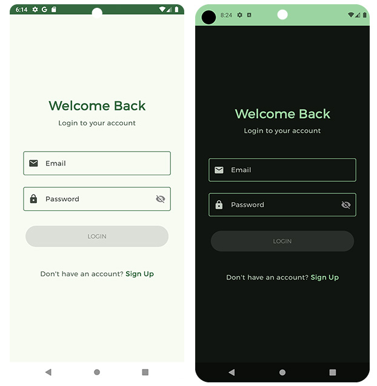
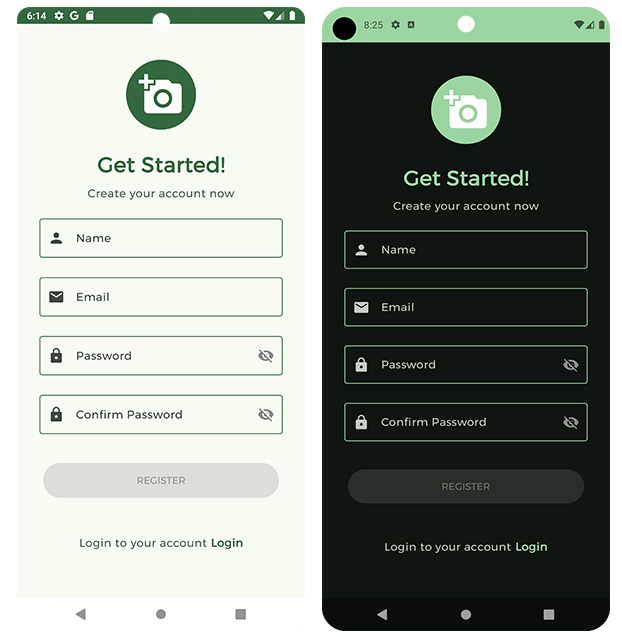
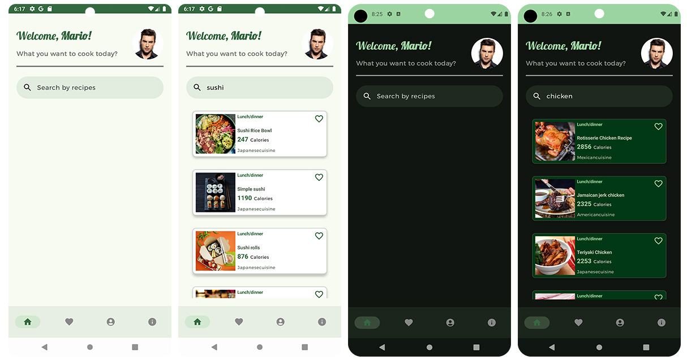
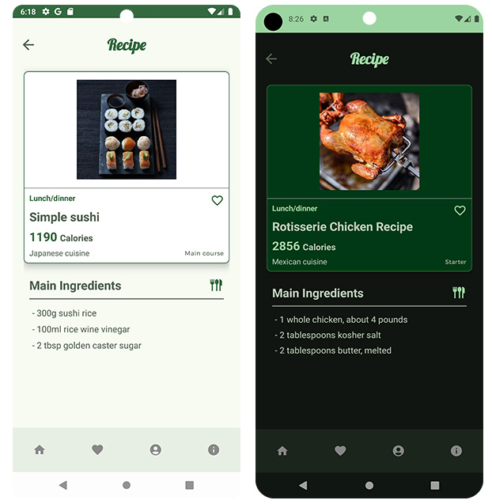
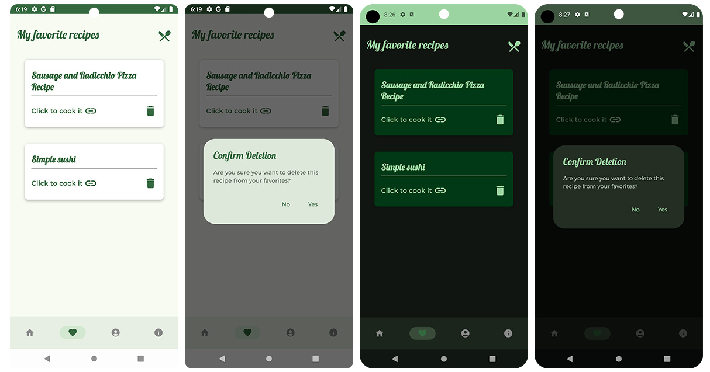
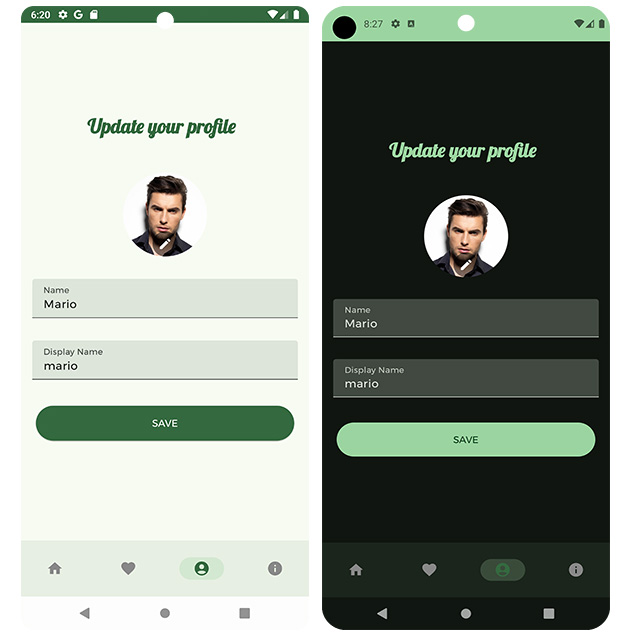
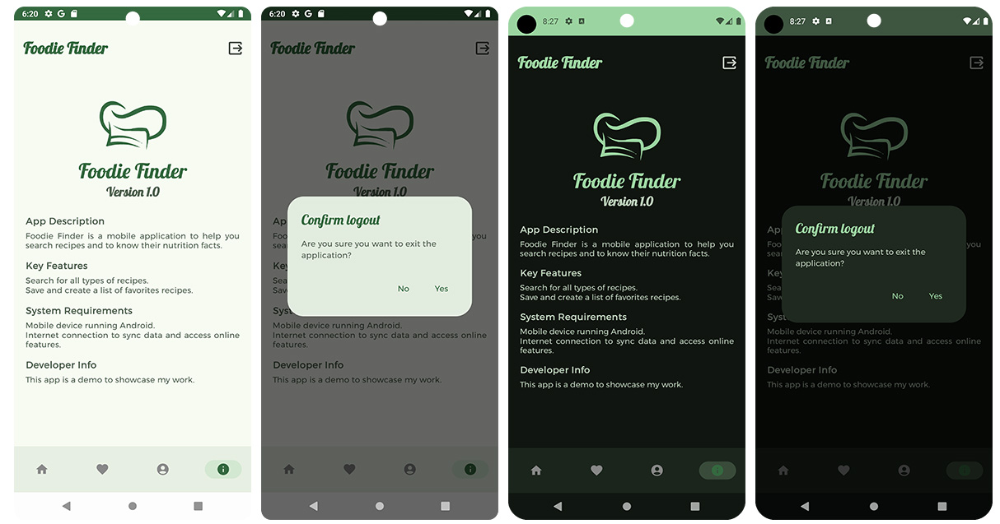

# Foodie Finder 

**Fooide Finder** is a mobile application for Android designed to provide a user authentication and registration system, as well as to store recipes and allow the modification of user data. It is a simple project that uses the following features.

## Features🛠️
*  MVVM architecture.
*  Coroutines
*  Dependency injection with Hilt
*  Firebase
*  Splash 
*  LiveData
*  Flows
*  StateFlow
*  Jetpack Compose
*  Material 3
* Api [Edamam](https://www.edamam.com/)

## Views Light/Dark Mode
* Visutal device 28/30

### Splash

### Login

### Register

### Home

### Details

### Favorite

### Profile

### Info

## Configuration API :globe_with_meridians:
Use the Edamam API, you have to register on their website. Add your **API_KEY** and **APP_ID** to the **local properties** file of the project.

## Note :speech_balloon:
Some features are being improved.

## Thank You🍀
Thank you so much for getting here!
